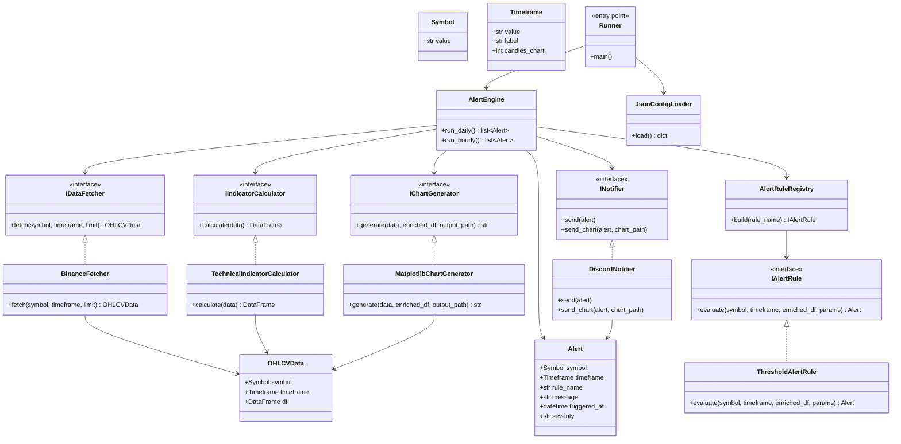

# CryptoAnalyzer

CryptoAnalyzer est une application Python orientée architecture qui récupère des données OHLCV depuis Binance, calcule des indicateurs techniques, applique des règles d’alerte et publie des alertes sur Discord avec un graphique associé.

## Architecture

L’application suit une architecture en couches et repose sur des abstractions pour garder le code modulaire.



## Composants principaux

- Fetcher : récupère les bougies OHLCV depuis Binance
- Indicateurs : calcule les SMA, RSI, MACD et Bollinger
- Règles : déclenchent des alertes selon des conditions configurables
- Moteur : orchestre l’ensemble du pipeline
- Notifier : envoie les alertes et graphiques vers Discord

## Structure du projet

```text
src/
  alerts/
  charts/
  engine/
  fetchers/
  indicators/
  notifiers/
  config_loader.py
  interfaces.py
```

## Installation

Prérequis :
- Python 3.10+
- pip

Installation des dépendances :

```bash
python -m pip install -r requirements.txt
```

## Configuration

Le projet lit sa configuration depuis le dossier [config](config).

Fichiers principaux :
- [config/settings.json](config/settings.json) : configuration active
- [config/settings_epxple.json](config/settings_epxple.json) : exemple de configuration

Points de configuration importants :
- `symbols` : paires à surveiller
- `timeframes` : périodes de temps utilisées
- `discord.webhook_url` : webhook Discord pour les notifications
- `alerts` : règles d’alerte à appliquer
- `hourly_variation` : paramètres de la surveillance horaire

## Exemple de configuration JSON

```json
{
  "symbols": ["BTCUSDC", "ETHUSDC"],
  "timeframes": [
    {"value": "1h", "label": "1 heure", "candles_chart": 48},
    {"value": "1d", "label": "1 jour", "candles_chart": 90}
  ],
  "discord": {
    "webhook_url": "https://discord.com/api/webhooks/...
  },
  "alerts": [
    {
      "name": "rsi_high",
      "type": "threshold",
      "timeframes": ["1d"],
      "severity": "WARNING",
      "conditions": [
        {
          "indicator": "rsi_14",
          "operator": ">",
          "value": 70
        }
      ]
    }
  ],
  "hourly_variation": {
    "threshold_pct": 3.0,
    "severity": "WARNING"
  }
}
```

## Utilisation

Exemples de lancement :

```bash
python -m src.engine.runner daily
python -m src.engine.runner hourly
python -m src.engine.runner chart BTCUSDC 1d
```

## Notes

Le projet est pensé pour être extensible : il est possible d’ajouter de nouveaux fetchers, indicateurs, règles d’alerte ou canaux de notification sans modifier le cœur du moteur.
