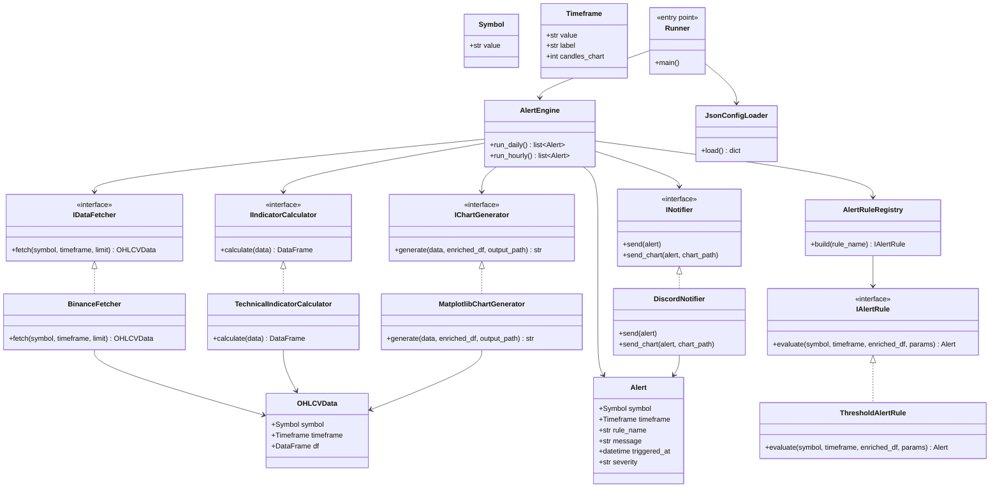

# CryptoAnalyzer

CryptoAnalyzer est une application Python orientée architecture qui récupère des données OHLCV depuis Binance, calcule des indicateurs techniques, applique des règles d’alerte et publie des alertes sur Discord avec un graphique associé.

## Architecture

L’application suit une architecture en couches et repose sur des abstractions pour garder le code modulaire.


```mermaid
classDiagram
    class Symbol {
        +str value
    }

    class Timeframe {
        +str value
        +str label
        +int candles_chart
    }

    class OHLCVData {
        +Symbol symbol
        +Timeframe timeframe
        +DataFrame df
    }

    class Alert {
        +Symbol symbol
        +Timeframe timeframe
        +str rule_name
        +str message
        +datetime triggered_at
        +str severity
    }

    class IDataFetcher {
        <<interface>>
        +fetch(symbol, timeframe, limit) OHLCVData
    }

    class IIndicatorCalculator {
        <<interface>>
        +calculate(data) DataFrame
    }

    class IAlertRule {
        <<interface>>
        +evaluate(symbol, timeframe, enriched_df, params) Alert
    }

    class INotifier {
        <<interface>>
        +send(alert)
        +send_chart(alert, chart_path)
    }

    class IChartGenerator {
        <<interface>>
        +generate(data, enriched_df, output_path) str
    }

    class BinanceFetcher {
        +fetch(symbol, timeframe, limit) OHLCVData
    }

    class TechnicalIndicatorCalculator {
        +calculate(data) DataFrame
    }

    class ThresholdAlertRule {
        +evaluate(symbol, timeframe, enriched_df, params) Alert
    }

    class AlertRuleRegistry {
        +build(rule_name) IAlertRule
    }

    class AlertEngine {
        +run_daily() list~Alert~
        +run_hourly() list~Alert~
    }

    class JsonConfigLoader {
        +load() dict
    }

    class DiscordNotifier {
        +send(alert)
        +send_chart(alert, chart_path)
    }

    class MatplotlibChartGenerator {
        +generate(data, enriched_df, output_path) str
    }

    IDataFetcher <|.. BinanceFetcher
    IIndicatorCalculator <|.. TechnicalIndicatorCalculator
    IAlertRule <|.. ThresholdAlertRule
    INotifier <|.. DiscordNotifier
    IChartGenerator <|.. MatplotlibChartGenerator

    AlertEngine --> IDataFetcher
    AlertEngine --> IIndicatorCalculator
    AlertEngine --> INotifier
    AlertEngine --> IChartGenerator
    AlertEngine --> AlertRuleRegistry
    AlertEngine --> Alert

    AlertRuleRegistry --> IAlertRule
    BinanceFetcher --> OHLCVData
    TechnicalIndicatorCalculator --> OHLCVData
    MatplotlibChartGenerator --> OHLCVData
    DiscordNotifier --> Alert
    Runner --> AlertEngine
    Runner --> JsonConfigLoader

    class Runner {
        <<entry point>>
        +main()
    }
```

## Composants principaux

- Fetcher : récupère les bougies OHLCV depuis Binance
- Indicateurs : calcule les SMA, RSI, MACD et Bollinger
- Règles : déclenchent des alertes selon des conditions configurables
- Moteur : orchestre l’ensemble du pipeline
- Notifier : envoie les alertes et graphiques vers Discord

## Structure du projet

```text
src/
  alerts/
  charts/
  engine/
  fetchers/
  indicators/
  notifiers/
  config_loader.py
  interfaces.py
```

## Installation

Prérequis :
- Python 3.10+
- pip

Installation des dépendances :

créer un venv et installer les dépendances

```bash
python3 -m venv .venv
source .venv/bin/activate
python3 -m pip install -r requirements.txt
```

## Configuration

Le projet lit sa configuration depuis le dossier [config](config).

Fichiers principaux :
- [config/settings.json](config/settings.json) : configuration active
- [config/settings_epxple.json](config/settings_epxple.json) : exemple de configuration

Points de configuration importants :
- `symbols` : paires à surveiller
- `timeframes` : périodes de temps utilisées
- `discord.webhook_url` : webhook Discord pour les notifications
- `discord.bot_token` : token du bot Discord utilisé par le script de nettoyage
- `discord.channel_id` : identifiant du salon ou du fil ciblé par le script de nettoyage
- `alerts` : règles d’alerte à appliquer
- `hourly_variation` : paramètres de la surveillance horaire

## Exemple de configuration JSON

```json
{
  "symbols": ["BTCUSDC", "ETHUSDC"],
  "timeframes": [
    {"value": "1h", "label": "1 heure", "candles_chart": 48},
    {"value": "1d", "label": "1 jour", "candles_chart": 90}
  ],
  "discord": {
        "webhook_url": "https://discord.com/api/webhooks/...",
      "bot_token": "VOTRE_TOKEN_DE_BOT",
      "channel_id": "ID_DU_SALON"
  },
  "alerts": [
    {
      "name": "rsi_high",
      "type": "threshold",
      "timeframes": ["1d"],
      "severity": "WARNING",
      "conditions": [
        {
          "indicator": "rsi_14",
          "operator": ">",
          "value": 70
        }
      ]
    }
  ],
  "hourly_variation": {
    "threshold_pct": 3.0,
    "severity": "WARNING"
  }
}
```

## Utilisation

Exemples de lancement :

```bash
python -m src.engine.runner daily
python -m src.engine.runner hourly
python -m src.engine.runner chart BTCUSDC 1d
```

## Nettoyage des messages Discord

Le script `scripts/clean_discord_messages.py` supprime les messages anciens envoyés par le webhook configuré dans `discord.webhook_url`. Il utilise l'API Discord avec un token de bot, car un webhook seul ne peut pas parcourir l'historique.

Le bot doit avoir accès à l'historique du salon ou du fil et la permission de gérer les messages. Renseignez son token dans `discord.bot_token` du fichier de configuration, puis lancez d'abord une simulation :

```bash
python scripts/clean_discord_messages.py --dry-run
```

Sans `--dry-run`, les messages de plus de 7 jours sont supprimés. Modifiez cette durée avec `--days` :

```bash
python scripts/clean_discord_messages.py --days 14
```

## Nettoyage des fichiers de log

Le script `scripts/clean_old_logs.py` supprime les fichiers `*.log` du dossier `logs` du projet dont la date de dernière modification dépasse la durée indiquée. Il supprime les logs de plus de 7 jours par défaut et ne supprime pas les autres types de fichiers.

```bash
python scripts/clean_old_logs.py
```

Utilisez `--days` pour définir une autre durée de rétention, en jours. La valeur doit être un entier strictement positif :

```bash
python scripts/clean_old_logs.py --days 14
```

Le chemin du dossier `logs` est déterminé à partir de l'emplacement du script ; la commande peut donc être lancée depuis un autre répertoire.

## Notes

Le projet est pensé pour être extensible : il est possible d’ajouter de nouveaux fetchers, indicateurs, règles d’alerte ou canaux de notification sans modifier le cœur du moteur.
