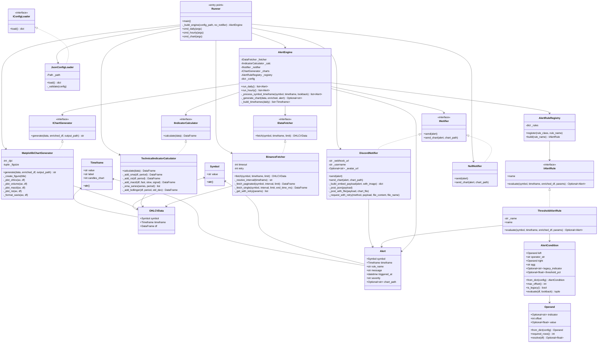

# Diagramme de classes de CryptoAnalyzer

Ce document décrit la structure orientée objet de l’application de surveillance technique et d’alertes crypto.

## Vue d’ensemble

L’architecture suit une approche en couches :

- Couche d’accès aux données : récupération OHLCV depuis Binance
- Couche d’analyse : calcul des indicateurs techniques
- Couche de règles : evaluation des alertes
- Couche de présentation : génération de graphiques et notification Discord
- Couche d’orchestration : moteur principal qui relie l’ensemble

## Diagramme Mermaid

## Description des principaux composants

### 1. Modèle de domaine

- Symbol : représente une paire de crypto-monnaie
- Timeframe : représente une période de temps (1h, 1d, 1w)
- OHLCVData : contient les données brutes issues d’une source externe
- Alert : structure finale d’alerte générée par le moteur

### 2. Couche d’accès aux données

- BinanceFetcher : récupère les bougies OHLCV depuis l’API Binance

### 3. Couche d’analyse technique

- TechnicalIndicatorCalculator : enrichit les données avec SMAs, RSI, MACD et Bollinger

### 4. Couche de règles d’alerte

- ThresholdAlertRule : règle générique configurable
- AlertCondition : représente une condition logique d’alerte
- Operand : définit une valeur ou un indicateur à comparer
- AlertRuleRegistry : instancie les règles par nom

### 5. Couche de notification et graphique

- DiscordNotifier : envoie l’alerte sur Discord
- MatplotlibChartGenerator : produit un graphique PNG multi-panneaux

### 6. Orchestration

- AlertEngine : pilote le cycle complet : fetch → calcul → règles → notification
- Runner : point d’entrée CLI pour exécuter l’application en mode daily, hourly ou chart

## Résumé architectural

Le projet est construit autour d’un moteur central qui dépend d’abstractions plutôt que de classes concrètes. Cela permet de :

- remplacer facilement un fetcher ou un notifier
- ajouter de nouvelles règles sans modifier le moteur
- tester les composants indépendamment
